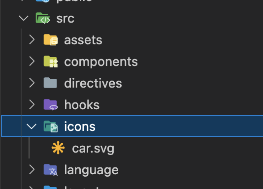
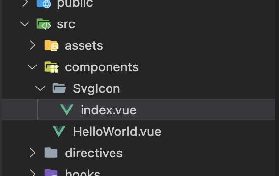

# 通过vite-plugin-svg-icons 使用SVG图片

## 一、安装 `vite-plugin-svg-icons`
```js
npm i vite-plugin-svg-icons -D
// 或者
yarn add vite-plugin-svg-icons -D
```
## 二、在 `main.js` 中注册
```js
import 'virtual:svg-icons-register'
```
## 三、在 `src` 目录下 新建文件夹 `icons` 如图:


## 四、在 vite.config.js 里配置
```js
import { defineConfig } from 'vite'
import { createSvgIconsPlugin } from 'vite-plugin-svg-icons'
import path, { resolve } from "path";

export default defineConfig(({ mode }) => {
  // ...
  return {
    plugins: [
      createSvgIconsPlugin({
        iconDirs: [resolve(process.cwd(), 'src/icons')],
        symbolId: '[name]'
      })
    ],
  }
})
```

## 五、新建 `svg` 组件
目录结构如下：


```vue
<template>
  <svg :class="svgClass" aria-hidden="true">
    <use :href="iconName" />
  </svg>
</template>
 
<script setup>
import { computed } from 'vue'
const props = defineProps({
  name: {
    type: String,
    Boolean,
    required: true,
  },
  className: {
    type: String,
    default: "",
  },
  color: {
    type: String,
    default: "#889aa4",
  },
});
const iconName = computed(() => (`#${props.name}`));
const svgClass = computed(() => {
  if (props.className) {
    return `svg-icon ${props.className}`;
  }
  return "svg-icon";
});
</script>
 
<style scoped>
.svg-icon {
  width: 1em;
  height: 1em;
  fill: currentColor;
  vertical-align: middle;
  color: inherit;
  outline: none;
}
</style>
```

## 六、在 `main.js` 注册为全局组件
```js
import svgIcon from './components/svgIcon/index.vue'
const app = createApp(App)
app.component('svg-icon', svgIcon).mount('#app')
```
:::tip 按需引用
  如果不想要注册全局组件也可以直接引用组件并使用
:::
```vue
<template>
 
  <SvgIcon name="issue"></SvgIcon>
 
</template>
 
<script setup>
import SvgIcon from "@/components/SvgIcon.vue";
</script>
```


## 七、使用组件
```vue
<template>
  <svg-icon name="car" class="any" />
</template>
```