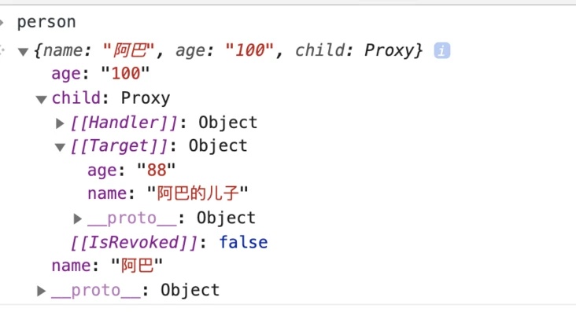

# vue3 源码分析
## Proxy和defineProperty的区别
### 前言
为什么会有这个标题呢？起因是在学习Vue3源码里看到的全面采用了ES6里`Proxy`。遂想到和Vue2里的`definePropery`有什么区别。

### 什么是`Proxy`
`Proxy`是ES6推出的一个类，给对象架设一层拦截器，但凡要`访问`和`修改`这个对象上的值或者属性，都必须先经过这层拦截器，`Proxy`也叫`代理器`，它代理了对对象的操作。那和`Object.defineProperty`的区别

### 什么是`Object.defineProperty`
`Object.defineProperty`是对对象上的属性进行新增或者修改，有2种写法，`数据描述符`和`访问器描述符`
```javascript
const obj = {
	name: 'Chrome';
}

// 数据描述符
Object.defineProperty(obj, 'age',{
  configurable: true, // 这个定义是否可以被delete
  enumerable: true, // 这个值是否可以被for in 枚举,或者Object.keys获取到
  writable: true, // 定义是否可以被修改
  value: '100'
})
// 访问器描述符
Object.defineProperty(obj, 'child', {
	configurable: true,
  enumerable: true,
  set(value) {
  	console.log(value)
  },
  get() {
  	console.log(this.value)
  }
})
```

### `Object.defineProperty`和 `Proxy`的区别

- `Object.defineProperty`对对象自身做修改，而`Proxy`只是在Object基础上一层拦截，不修改原对象
- 监听不了数组的变化
- 监听手段比较单一，只能监听`set`和`get`，`Proxy`有十几种监听
- 必须得把所有的属性全部添加`defineProperty`。`Proxy`对整个对象都会进行拦截
### 1、为什么`Proxy`不用遍历每个属性

```javascript
var needProxyObj = {name: 'chrome', age:'800'}
var proxyObj = new Proxy(needProxyObj, {
    set(target, key, value, receiver) {
        consnole.log('proxy修改了', key, value)
    }
})

proxyObj.name = 'safari'; // proxy修改了 name safari

```
Proxy是代理在`对象`级别的，defineProperty是代理到`静态的值`级别，所以Proxy的强大就在这里

### 2、为什么`Proxy`不修改原对象，为什么`Proxy`是在对象上面加一层代理?
```javascript
var needProxyObj = {name: 'chrome', age:'800'}
var proxyObj = new Proxy(needProxyObj, {
    set(target, key, value, receiver) {
        consnole.log('proxy修改了', key, value)
    }
})
proxyObj.name = 'safari'; // proxy修改了 name safari
needProxyObj.child = 'sun'; // sun , 没有被拦截
console.log(proxyObj.child); // sun
needProxyObj === proxyObj; // false
```
看到没, 当我修改被代理之前的对象的时候，拦截器没有起作用，并且被代理的新对象proxyObj的child值也跟着变化了, 但是needProxyObj === proxyObj; // false, 这又是蜜汁操作之一了。其实也好理解，代理对象和被代理的对象，他们在表面上是不一样的，其实在底层是同一个对象。

### 3、为什么我又说Proxy不修改原对象也是不准确的。
这就涉及到Proxy和defineProperty的一个共同特性，不支持对象嵌套。需要递归去实现。
```javascript
var person = {
    name: '阿巴',
    age: '100',
    child: {
        name: '阿巴的儿子',
        age: '88'
    }
}
var proxyEvent = {
       
}
var deepProxy = function(obj) {
    if (typeof obj === 'object') {
        Object.entries(obj).forEach(([key, value]) => {
            obj[key] = deepProxy(value);
        })
        return new Proxy(obj, proxyEvent)
    }
    return obj;
}
deepProxy(person);
```

这就是我说为什么不准确的原因了, 所以万不得已，真心不推荐用递归的方式去设置Proxy, 当然，有办法递归设置Proxy，咱们就有办法给它还原
```javascript

function proxyToObject(proxyObj) {
    const next = function (obj, mergeObj) {
        if (typeof obj === 'object') {
            Object.entries(obj).forEach(([key, value]) => {
                if (!value) {
                    mergeObj[key] = value;
                } else if (value instanceof Array) {
                    mergeObj[key] = next(value, []);
                } else if (value instanceof Object) {
                    mergeObj[key] = next(value, {});
                } else {
                    mergeObj[key] = value;
                }
            })
        }
        if (obj && obj instanceof Array) {
            for (let value of obj) {
                mergeObj.push(next(value, {}));
            }
        }
        return mergeObj;
    }
    return next(proxyObj, {});
}
proxyToObject(person); // 然后就恢复了
```
### 4、为什么说Proxy可以监听数组的访问
我们都知道在Vue中，由于defineProperty的局限性，数组的push被认为是变异的特性，为什么vue的push可以被监听到呢，是因为vue把数组对象的push给重写了，进行拦截，这导致增加了不少额外的操作
```javascript
// 来看看Proxy怎么实现
var arr = [1,2,3,4];
let arrProxy = new Proxy(arr, {
    get(target, propKey) {
        if (Array.isArray(target) && typeof Array.prototype[propKey] === 'function') {
            Promise.resolve().then(e => {
                console.log('操作了数组', propKey);
            })
        }
        return target[propKey]
    }
})
arrProxy.push(5);
console.log('push结束了');
// push结束了
// 操作了数组 push

```
为什么要使用Promise.resolve(), 是因为push是一个同步操作，在访问 push的时候还没有执行这个函数，所以想在push之后做一些事情，就可以用这个微任务机制来把操作滞后


